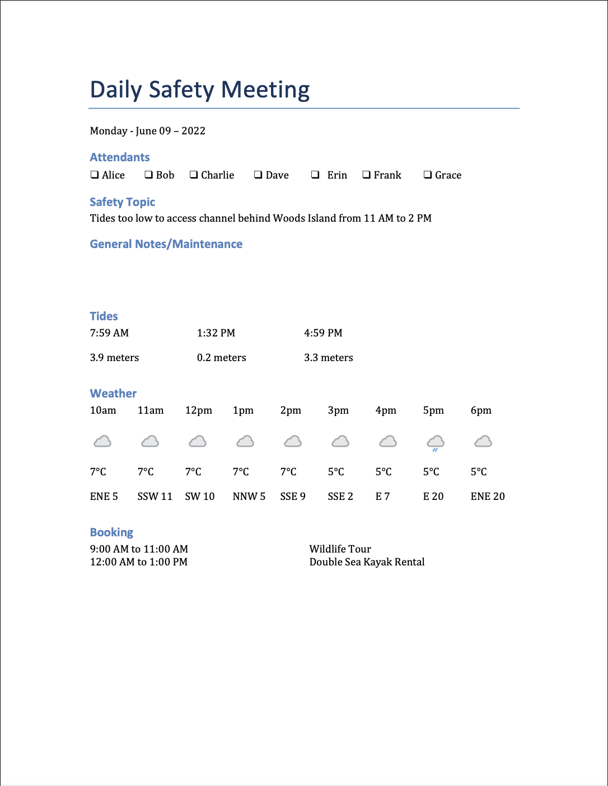

# Morning Meeting Generator

A tool to generate a daily meeting document for [Sealegs
Kayaking Adventures](https://sealegskayaking.com) in Ladysmith, BC.
Information was to be gathered daily from multiple websites and written down
onto a meeting template.  This program automates the process and saves about 10
minutes each morning.  



## Requirements

Python 3.6 or higher

The following Python modules:
- beautifulsoup
- requests
- python-docx
- dataclasses
- dateparser
- datetime


## Installation

Clone the repository.     
```bash
git clone https://github.com/BradHillier/morning-meeting-generator.git
```
Install the required libraries by running 
```
pip3 install -r requirements.txt.
```

## Configuration

To use this program, you will need to create a config.json file in the root directory of the project.

To do this, run the following command from the projects `src` directory

```
python3 main.py. 
```

This will prompt you to enter the following information:

- A list of employee names
- A personal access token for the TimeTree API
- The ID of a calendar in your TimeTree account
- The output location for the generated meeting documents (must be a directory)

After following all the prompts and successfully completing the config file, the program can be run normally. The resulting config.json file will have the following structure:

```json
{
  "employees": [
    "Employee 1",
    "Employee 2",
    "Employee 3"
  ],
  "personal access token": "YOUR_TIMETREE_PERSONAL_ACCESS_TOKEN",
  "calendar ID": "YOUR_TIMETREE_CALENDAR_ID",
  "output location": "PATH_TO_OUTPUT_FOLDER",
  "api key": "YOU_WEATHER_API_KEY"
}
```
To get your personal access token and calendar ID, you will need to sign up for a [TimeTree API account](https://developers.timetreeapp.com/en/docs/api/overview). To get your weather API key, you will need to sign up for a [WeatherAPI account](https://www.weatherapi.com).

## Running the program

To run the program, simply run 
```bash
python3 main.py
```
in the project's `src` directory. The program will generate a Microsoft Word document in the output folder specified in the config.json file. The file will be named morning_meeting_DD-MM-YY.docx, where DD-MM-YY is the current date.
    
## Automatically Generated Safety Topics

- **Heat exhaustion warning:** If the temperature during any hour of the day is forecast to be 30 degrees Celsius or higher, the program will generate a warning about heat exhaustion. It will recommend that staff members alternate working in the sun and drink plenty of water to prevent heat exhaustion.

- **Low tide warning:** If the tide is forecast to be too low to access the channel behind Woods Island during any operational hours of the day, the program will generate a warning about this. It will specify the start and end times during which the channel will be inaccessible.

- **UV index warning:** If the UV index is forecast to be 3 or higher during any hours of the day, the program will generate a warning about this. It will recommend that staff members wear sunscreen and specify the start and end times during which the UV index will be high.

## Technologies used

### APIs

**WeatherAPI:** This API is used to get weather data for the given location. This includes the temperature, wind direction and speed, and UV index for each hour of the day.

**TimeTree API:** This API is used to get booking data from a TimeTree. This includes the name and start and end time of each booking.

### Webscraping

**Beautiful Soup:** This is a Python library that is used for webscraping. In this project, it is used to scrape tide data from https://tides.gc.ca/en/stations/07460.


